# Longitudinal Analysis of SSH Cowrie Honeypots

This project is about a Command Line Map-Reduce tool to analyze cowrie log files on remote servers / local folders 
over time and create a visualization and statistics of the data.

The tool uses multiple log files <cowrie.json.YYYY-MM-DD> to create a cummulated information file and 
visualization from local or remote folder path, finally creating statistics about all the event changes over time.

	python3 cowralyze.py --help               # shows available commands and a description for each command
	

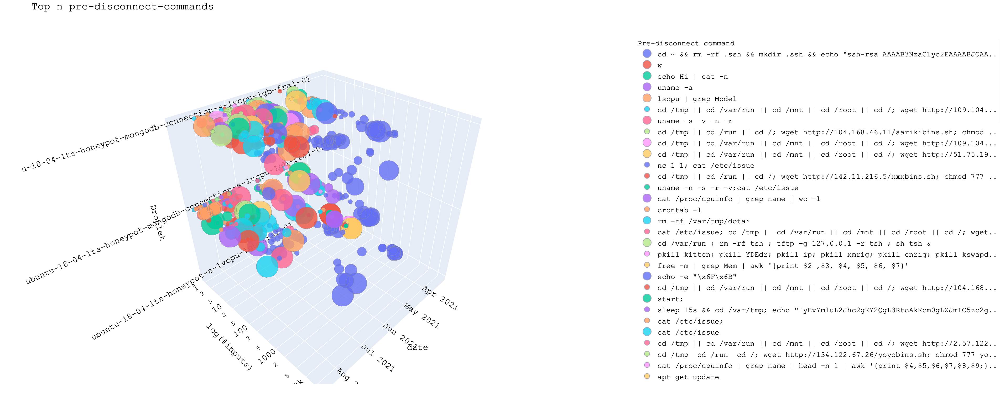
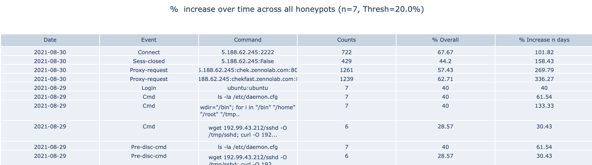

Furthermore there's the possibility to trace commands by session id or ip, as well as creating Sankey Command Chain Plots
for specific log files.
	

    
## Motivation
This project was created in course of my Bachelor's Thesis: Longitudinal Analysis of SSH Honeypots.
While a large number of honeypot related tools exist, they generally focus on high-level aggregated statistics and not about individual log anomalies.
The aim of this project is to provide a tool to get a quick overview of the changes over time of possibly hundred's of cowrie honeypots.
The stats.html provides the accumulated percentual changes over time, result.html provides the visualization across the nodes.

## Requirements

+ Remote Nodes tested only with Digitalocean and Ubuntu 18.04 LTS.
+ Python Environment requirements can be viewed in the requirements.txt 

## Installation or Getting Started

	git clone https://github.com/deroux/longitudinal-analysis-cowrie.git
    cd longitudinal-analysis-cowrie
    cd project

    source venv/bin/activate
    pip3 install -r requirements.txt

    python3 cowralyze.py --help
    
    # or alternatively use setup.py
    virtualenv myenv
    source myenv/bin/activate
    pip install .

## Features / Usage of available commands  
### analyze-local 
+ Properties 
  
Usage: cowralyze.py analyze-local [OPTIONS]
    
      Map-Reduce all log files in local folder, create reduced.json, create
      result.html for visualization.
  
      Options:
      -p, --path PATH             Local folder path to look for log files to map
                                  reduce and analyze  [required]
      -f, --logfile TEXT          Filename of reduced log file of generated *.json
      -o, --outfile TEXT          Filename of result visualization *.html
      -n, --top_n_events INTEGER  Reduce & visualize top n occurring events in
                                  cowrie log files
      -t, --threshold FLOAT       Percentage of event changes visible in report,
                                  e.g. user:password increased > x %
      -n, --last_n_days INTEGER   Create statistics for specific event of %
                                  increase for last n days across honeypots
      --help                      Show this message and exit.

+ Execution workflow
> python3 cowralyze.py analyze-local -p ./
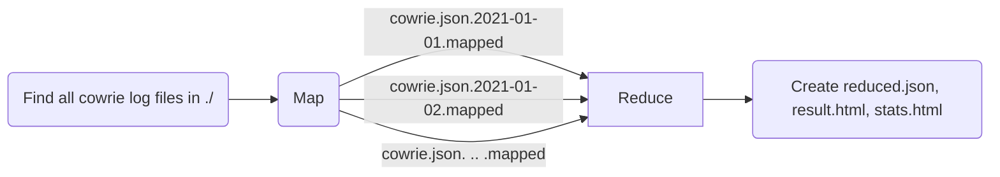

### analyze-remote 
**Currently only tested with Digitalocean - Ubuntu 18.04 LTS**
  
+ Properties 
Usage: cowralyze.py analyze-remote [OPTIONS] 
    
      Map-Reduce all log files on remote cowrie node, download reduced.json,
      create result.html for visualization.
    
      Options:
      -i, --ip TEXT                   IP Address of remote droplet  [required]
      -p, --port TEXT                 Port of remote droplet (real SSH port of
                                      server, not cowrie port)  [required]
      -u, --user TEXT                 Login username of remote droplet
      -pw, --pw TEXT                  Login password of remote droplet  [required]
      -n, --top_n_events INTEGER      Reduce & visualize top n occurring events in
                                      cowrie log files
      -r, --setup_remote_environment BOOLEAN
                                      Setup python environment and copy scripts to
                                      remote node (only first time needed)
      -f, --logfile TEXT              Filename of reduced log file of generated
                                      *.json
      -o, --outfile TEXT              Filename of result visualization *.html
      -t, --threshold FLOAT           Percentage of event changes visible in
                                      report, e.g. user:password increased > x %
      -l, --last_n_days INTEGER       Create statistics for specific event of %
                                      increase for last n days across honeypots
      --help                          Show this message and exit.

+ Execution workflow 
  
> e.g. 3 Cowrie Instances running on 3 Digital Ocean Nodes (Ubuntu 18.04 LTS) where Python Environment not set up.
>
> We want TOP 5 events of every log file to be accummulated to get a grasp of what's happening on our honeypots. 

  `python3 cowralyze.py analyze-remote -i 104.248.245.133 -i 104.248.253.81 -i 104.248.253.142 -u root -u root -u root -p 2112 -p 2112 -p 2112 -n 5 -n 5 -n 5 -pw pass -pw pass -pw pass -r True -r True -r True`

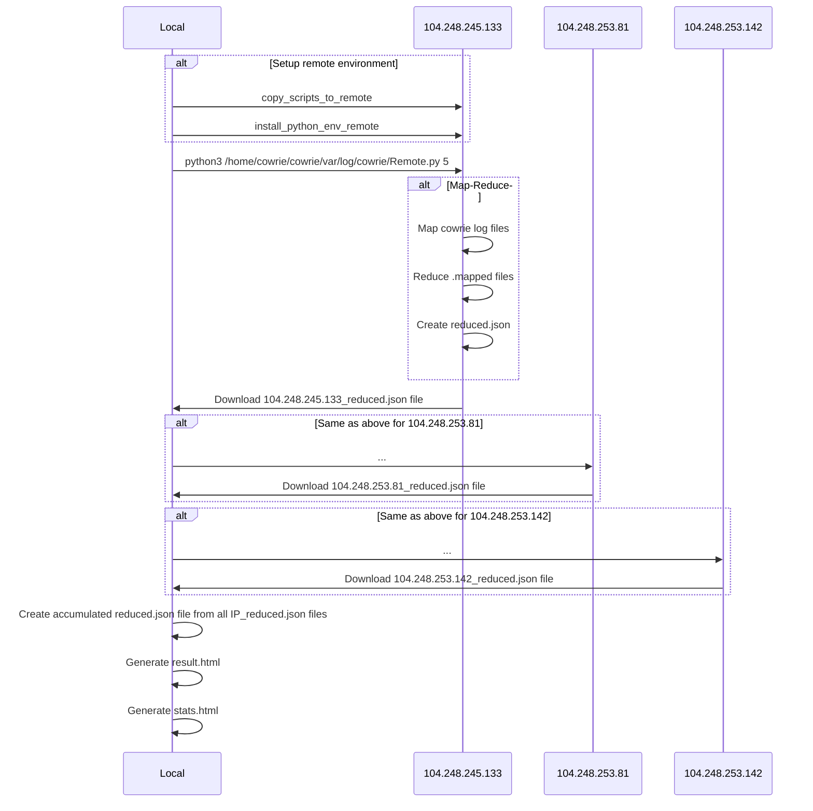
### combine-reduced
Usage: cowralyze.py combine-reduced [OPTIONS]
 
    Combine reduced.json files from multiple nodes to single reduced.json
      Params:     files    (str, n): Filename/s of result.json files to combine
      outfile     (str): Filename of final output *.json Returns:     Creates
      file.json with combined reduced file data
    
    Options:
      -o, --outfile TEXT  Filename of final output *.json
      --help              Show this message and exit.
  

+ Execution workflow
>  python3 cowralyze.py combine-reduced -o combined.json 104.248.253.81_reduced.json 104.248.245.133_reduced.json
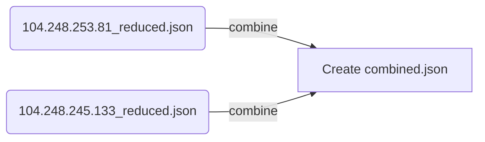

### command-chains
Usage: cowralyze.py command-chains [OPTIONS]
 
    Use cowrie.json.YYYY-MM-DD file to trace commands executed for all sessions
    in Sankey-Plot.
  
    Options:
      -f, --file PATH  Filename of log file to create trace of commands executed
                       [required]
      --help           Show this message and exit.
    

+ Execution workflow
>  python3 cowralyze.py command-chains -f cowrie.json.2021-05-08
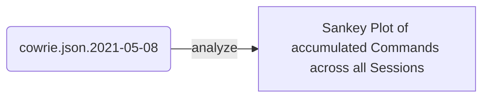
### download-logs
Usage: cowralyze.py download-logs [OPTIONS]
 
  
    Download all log files from remote node.
  
    Options:
      -i, --ip TEXT      IP Address of remote droplet  [required]
      -p, --port TEXT    Port of remote droplet (real SSH port of server, not
                         cowrie port)  [required]
      -u, --user TEXT    Login username of remote droplet
      -pw, --pw TEXT     Login password of remote droplet  [required]
      -f, --folder PATH  Local folder path to store log files from remote into.
                         [required]
      --help             Show this message and exit.

    

+ Execution workflow
>  python3 cowralyze.py download-logs -i 104.248.245.133 -u root -p 2112 -pw pass -f /Users/dominicrudigier/Documents/longitudinal-analysis-cowrie/logs/todelete

### map
Usage: cowralyze.py map [OPTIONS]
   
    Map local log file and create LOG_FILE.mapped
  
    Options:
      -f, --file TEXT  Filename of cowrie log file to map  [required]
      -m, --mode TEXT  Behaviour on already existing mapped file: c=continue,
                       w=overwrite
      --help           Show this message and exit.

+ Execution workflow
>  python3 cowralyze.py map -f example_logs/cowrie.json.2021-05-03

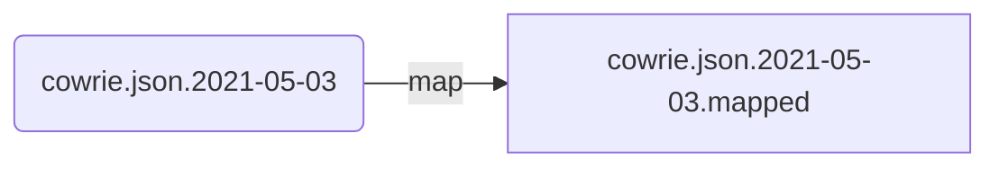
### reduce
Usage: cowralyze.py reduce [OPTIONS]
   
   
    Reduce local log file/s and create reduced.json and REDUCED_FILE.reduced for
    further usage Params:     files    (str, n): Filename/s of .mapped files to
    reduce
  
    Options:
      -o, --outfile TEXT          Filename of reduced data *.json
      -n, --top_n_events INTEGER  Reduce & visualize top n occurring events in
                                  cowrie log files
      -m, --mode TEXT             Behaviour on already existing reduced file:
                                  c=continue, w=overwrite
      --help                      Show this message and exit.

+ Execution workflow
>  python3 cowralyze.py reduce example_logs/cowrie.json.2021-05-03.mapped example_logs/cowrie.json.2021-05-04.mapped

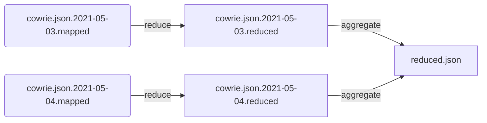
### statistics
Usage: cowralyze.py statistics [OPTIONS]
   
    Use reduced.json file and create stats.html visualization out of it
  
    Options:
      -f, --logfile PATH         Filename of reduced log file of generated *.json
                                 [required]
      -o, --outfile TEXT         Filename of result visualization *.html
      -t, --threshold FLOAT      Percentage of event changes visible in report,
                                 e.g. user:password increased > x %
      -n, --last_n_days INTEGER  Create statistics for specific event of %
                                 increase for last n days across honeypots
      --help                     Show this message and exit.

+ Execution workflow
>  python3 cowralyze.py statistics -f 104.248.253.142_reduced.json

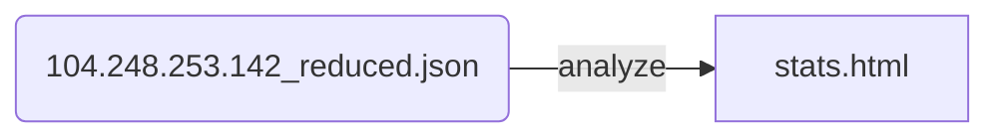

### trace-ip
Usage: cowralyze.py trace-ip [OPTIONS]

    Use cowrie.json.YYYY-MM-DD file and IP to trace commands executed
  
    Options:
      -f, --file PATH  Filename of log file to find session id in and create trace
                       of commands executed  [required]
      -i, --ip TEXT    Session ID for specific session trace of interest
                       [required]
      --help           Show this message and exit.

+ Execution workflow
>  python3 cowralyze.py trace-ip -f example_logs/cowrie.json.2021-05-03 -i 101.32.218.36 

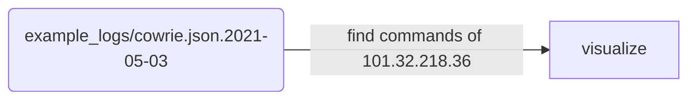
### trace-sid
Usage: cowralyze.py trace-sid [OPTIONS]

    Use cowrie.json.YYYY-MM-DD file and Session ID to trace commands executed
  
    Options:
      -f, --file PATH          Filename of log file to find session id in and
                               create trace of commands executed  [required]
      -sid, --session_id TEXT  Session ID for specific session trace of interest
                               [required]
      --help                   Show this message and exit.

+ Execution workflow
>  python3 cowralyze.py trace-sid -f example_logs/cowrie.json.2021-05-03 -sid d3ddf15870bd 

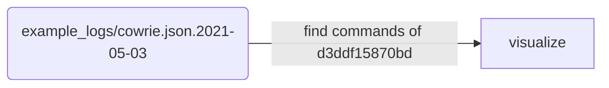
### visualize
Usage: cowralyze.py visualize [OPTIONS]

    Use reduced.json file and create result.html and stats.html visualization out of it
  
    Options:
      -f, --logfile PATH         Filename of reduced log file of generated *.json
                                 [required]
      -o, --outfile TEXT         Filename of result visualization *.html
      -t, --threshold FLOAT      Percentage of event changes visible in report,
                                 e.g. user:password increased > x %
      -n, --last_n_days INTEGER  Create statistics for specific event of %
                                 increase for last n days across honeypots
      --help                     Show this message and exit.

+ Execution workflow
>  python3 cowralyze.py visualize -f 104.248.245.133_reduced.json

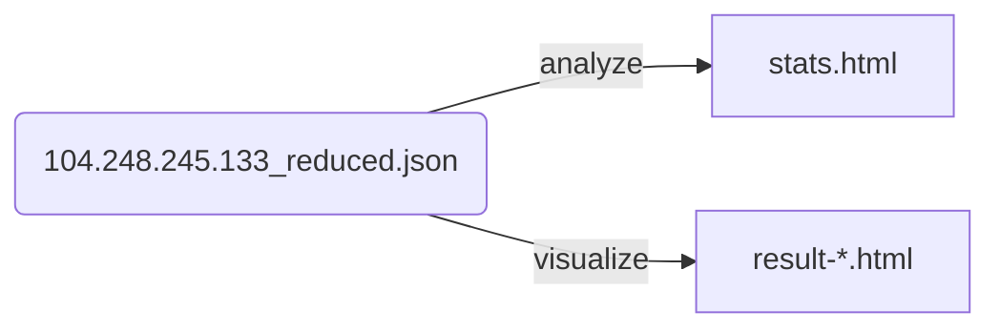
    
## Contributors
+ In general, feel free to advance every functionality / problem / feature of the project or create an issue of a wanted feature.
+ [Create your Issue on Github](https://github.com/deroux/longitudinal-analysis-cowrie/issues)
+ [Join the Slack Channel and ask questions](https://join.slack.com/t/longitudinala-bbj1680/shared_invite/zt-t64komf9-tiAre9JPWnDlXQkGKDxSbg)

## License
Copyright © 2021 deroux

Permission is hereby granted, free of charge, to any person obtaining a copy of this software and associated documentation files (the "Software"), to deal in the Software without restriction, including without limitation the rights to use, copy, modify, merge, publish, distribute, sublicense, and/or sell copies of the Software, and to permit persons to whom the Software is furnished to do so, subject to the following conditions:

The above copyright notice and this permission notice shall be included in all copies or substantial portions of the Software.

THE SOFTWARE IS PROVIDED "AS IS", WITHOUT WARRANTY OF ANY KIND, EXPRESS OR IMPLIED, INCLUDING BUT NOT LIMITED TO THE WARRANTIES OF MERCHANTABILITY, FITNESS FOR A PARTICULAR PURPOSE AND NONINFRINGEMENT. IN NO EVENT SHALL THE AUTHORS OR COPYRIGHT HOLDERS BE LIABLE FOR ANY CLAIM, DAMAGES OR OTHER LIABILITY, WHETHER IN AN ACTION OF CONTRACT, TORT OR OTHERWISE, ARISING FROM, OUT OF OR IN CONNECTION WITH THE SOFTWARE OR THE USE OR OTHER DEALINGS IN THE SOFTWARE.
